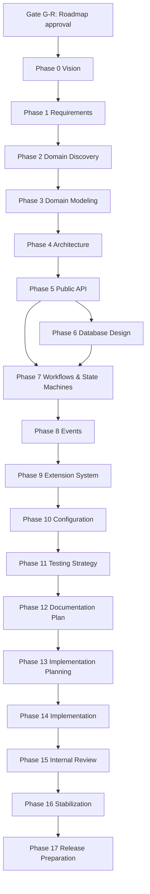

# Laravel Trust & Safety — Engineering Roadmap

**Package:** `syriable/laravel-casework` (working title: *Laravel Trust & Safety*)
**Namespace:** `Syriable\Casework`
**Document owner:** Fable (Project Director & Lead Software Architect)
**Status:** DRAFT — awaiting approval (Gate G-R)
**Version:** 1.0.0
**Date:** 2026-07-14

---

## 1. Project Vision

Laravel Trust & Safety is a production-grade, UI-agnostic moderation platform for Laravel
applications. It gives any Laravel application the complete machinery of a professional
trust-and-safety operation — reporting, case management, investigation, moderator decisions,
restrictions, warnings, suspensions, appeals, and audit history — as a clean, Laravel-native
package.

The package is to Laravel moderation what `spatie/laravel-permission` is to authorization:
the obvious, boring, reliable default. Applications keep full ownership of their frontend
(Blade, Livewire, Filament, Inertia, Vue, React, mobile, or pure API) while the package owns
the domain: models, workflows, state machines, events, contracts, and extension points.

### Vision statement

> Any Eloquent model can be reported. Every report can become a case. Every case moves
> through an explicit, auditable workflow to a decision. Every decision can carry
> consequences — warnings, restrictions, suspensions — and every consequence can be
> appealed. Everything that happens is recorded, observable, and extensible. No UI is
> ever shipped.

### Success criteria

- Installable in under five minutes: `composer require`, publish migrations, migrate, go.
- A developer can wire a working report-to-decision flow reading only the README.
- Every state transition is observable via events and recorded in the audit history.
- Applications can replace or extend every meaningful behavior without forking.
- Test suite and static analysis (PHPStan max level practical, Pest) pass on every commit.
- Zero UI code, zero frontend assumptions, zero JavaScript.

---

## 2. Scope

### In scope (v1.0)

| Capability | Summary |
|---|---|
| Reporting | Report any Eloquent model via a `Reportable` trait/contract; reporter may be a user, system, or anonymous source. |
| Report reasons | Configurable, extensible reason taxonomy (database and/or enum-backed). |
| Case management | Group reports into cases; assignment, status, priority, notes. |
| Moderation workflows | Explicit, configurable workflow definitions for case lifecycles. |
| State machines | Guarded state transitions for reports, cases, restrictions, and appeals. |
| Investigation tools | Attach evidence, notes, and related subjects to a case (data layer, not UI). |
| Moderator decisions | First-class decision records: dismiss, uphold, escalate, custom outcomes. |
| Restrictions | Apply restrictions to any model; temporary (auto-expiring) and permanent. |
| Warnings | Issue and track formal warnings against subjects. |
| Suspensions | Time-boxed or indefinite suspensions as a restriction specialization. |
| Appeals | Appeal a decision or restriction; appeal workflow with its own states. |
| Scope-based permissions | Moderator abilities scoped by area/category via Gates and Policies. |
| Audit history | Immutable, queryable record of every domain action. |
| Events | A Laravel event for every meaningful domain occurrence. |
| Notification hooks | Contracts/hooks so apps plug in their own notification channels. |
| Automation hooks | Pipelines/hooks for auto-triage, auto-escalation, external ML scoring. |
| Policies & contracts | Interfaces for every replaceable behavior; policies for authorization. |
| Extension points | Custom reasons, outcomes, restriction types, workflow steps, resolvers. |

### Explicitly UI-agnostic

The package ships **no** routes, controllers (beyond none), views, Blade components,
Livewire components, Inertia pages, or frontend assets. The public surface is: Eloquent
models, actions/services, contracts, events, facades, configuration, and artisan commands
(operational only, e.g. expiring restrictions).

### Non-goals (v1.0)

- **No UI of any kind** — no admin panel, no Filament plugin, no Blade views. (A first-party
  UI may be a *separate* package later; never in this one.)
- **No content analysis / ML** — no toxicity scoring, image classification, or spam
  detection. Automation *hooks* let apps integrate their own.
- **No queue/email/SMS implementations** — notification *hooks* only; the app owns channels.
- **No user management** — the package never creates or owns the User model.
- **No multi-tenancy framework** — the design must not block tenancy packages, but v1 does
  not implement tenant isolation itself.
- **No legal/compliance features** (DSA/DMCA report intake forms, transparency-report
  generation) beyond the audit data that would feed them.
- **No REST/GraphQL API endpoints** — apps expose their own APIs over the package services.
- **No support for non-Eloquent persistence** in v1.

Scope changes require a new ADR and Fable's approval. Scope creep is treated as a defect.

---

## 3. Engineering Principles

1. **Laravel Native** — Eloquent, events, gates/policies, service container, config,
   migrations, artisan. No parallel framework.
2. **Simple > Clever** — the mainstream case must read like idiomatic Laravel.
3. **Explicit > Implicit** — state transitions, permissions, and side effects are declared,
   never inferred.
4. **Composition > Inheritance** — traits for opt-in model behavior, contracts + container
   bindings for replaceable behavior; shallow class hierarchies.
5. **Contracts > Tight Coupling** — every replaceable behavior has an interface bound in
   the container.
6. **Stable public API** — semantic versioning; backward compatibility whenever possible;
   documented upgrade paths otherwise.
7. **Highly Tested** — Pest feature + unit tests, Testbench integration tests, PHPStan at
   the highest practical level, type coverage enforced.
8. **Documented as a deliverable** — docs ship with the phase that produced the behavior,
   never "later."
9. **Extension without forking** — if a plausible application need requires editing vendor
   code, the design is wrong.
10. **Never over-engineer** — no abstraction without a second concrete consumer or an
    approved ADR justifying it.

House style references: Spatie package conventions, Laravel framework conventions,
Symfony's BC promise discipline.

---

## 4. Architecture Strategy

- **Architecture First.** Nothing is implemented before its design is approved. Phases 0–13
  are pure design/documentation; implementation begins only at Phase 14 behind gate G13.
- **ADR-governed.** Every significant decision is captured as an ADR in `docs/adr/`
  (`NNNN-title.md`) with Context, Problem, Alternatives, Decision, Consequences. Approved
  ADRs are binding; changing one requires a superseding ADR.
- **Domain-centered package layout.** A single package, organized by domain concept
  (Reports, Cases, Decisions, Restrictions, Appeals, Audit) rather than by technical layer,
  with thin Laravel integration at the edges (service provider, config, facade).
- **State machines as the backbone.** Reports, cases, restrictions, and appeals each own an
  explicit state machine; transitions are the only way state changes, and every transition
  emits an event and writes audit history.
- **Events as the integration surface.** Applications integrate primarily by listening;
  the package never assumes what happens downstream (notifications, automation).
- **Contracts + container bindings as the extension surface.** Reason providers, outcome
  types, restriction enforcement checks, workflow definitions, and subject resolvers are
  all swappable.
- **Configuration over code generation.** One published config file; no scaffolding of app
  code.
- **Database as a stable contract.** Migrations are designed once (Phase 6), reviewed for
  indexing/polymorphism/scale, and treated as public API after release.

The concrete architecture (aggregates, table design, API signatures) is produced by
Phases 2–10 — this roadmap deliberately does not pre-decide it.

---

## 5. Engineering Teams

Fable creates the following teams. Each team owns exactly one responsibility, receives only
the context required for its task, and hands off summarized results. Fable may merge, split,
or retire teams as phases demand.

| # | Team | Responsibility | Primary phases |
|---|---|---|---|
| T1 | Product & Vision | Vision document, personas, success metrics | 0 |
| T2 | Domain Analysis | Trust & safety domain research, glossary, real-world workflows | 1–2 |
| T3 | Domain Modeling | Entities, relationships, invariants, aggregate boundaries | 3 |
| T4 | Software Architecture | Package-internal architecture, layering, ADR drafting | 4 |
| T5 | Laravel & Package Architecture | Service provider, config, facade, trait design, Laravel integration | 4–5, 10 |
| T6 | Public API Design | Developer-facing API: models, services, traits, naming | 5 |
| T7 | Database Design | Schema, migrations, polymorphism, indexing, scale review | 6 |
| T8 | Workflow & State Machine Design | Workflow definitions, state machines, transition guards | 7 |
| T9 | Event Architecture | Event catalog, payload design, notification & automation hooks | 8 |
| T10 | Security & Authorization | Scope-based permissions, policies, threat review, data sensitivity | 4–9 (cross-cutting), dedicated review at 8–9 |
| T11 | Extension System | Extension points, contracts, binding strategy, plugin guidelines | 9 |
| T12 | Testing Strategy | Test plan, coverage targets, CI matrix, Testbench setup | 11, continuous from 14 |
| T13 | Documentation & DX | README, docs site content, examples, upgrade guides | 12, continuous |
| T14 | Implementation | Writing the package code per approved designs | 14 |
| T15 | Quality Assurance | Internal review, static analysis, mutation/edge testing | 15–16 |
| T16 | Release Engineering | Versioning, changelog, tagging, Packagist readiness | 17 |

### Collaboration rules

- Teams work only from approved upstream deliverables; they never redesign approved work.
- Handoffs are summaries, not transcripts — only what the receiving team needs.
- No duplicate analysis: approved decisions are cited by ADR number, not re-argued.
- All deliverables flow to Fable for review; nothing advances without approval.

### AI model assignment strategy

Fable assigns the cheapest model adequate for each task:

- **Strong reasoning models** (Fable-tier/Opus-tier): architecture decisions, domain
  modeling, state machine design, security review, API design, final reviews.
- **Mid-tier models** (Sonnet-tier): implementation of approved designs, test writing,
  documentation drafting, migrations from approved schema.
- **Small/fast models** (Haiku-tier): formatting, changelog entries, boilerplate,
  glossary compilation, checklist verification, docblock polish.

Rule of thumb: design costs thought, implementation of an approved design should not.
Expensive reasoning is never spent on tasks a cheaper model can complete correctly.

---

## 6. Development Phases

Each phase lists objectives, dependencies, deliverables, review criteria, and Definition of
Done. Every phase ends at an approval gate (G0…G17). **A gate is passed only by Fable's
explicit approval. Approval is never assumed.**

### Phase 0 — Vision
- **Objectives:** Ratify the product vision, personas (app developer, moderator-as-modeled-actor,
  end user-as-subject), success metrics, and package positioning vs. existing ecosystem
  packages.
- **Dependencies:** Approved roadmap (Gate G-R).
- **Deliverables:** `docs/vision.md`; competitive/ecosystem survey summary.
- **Review criteria:** Vision is specific, measurable, UI-agnostic, and consistent with §2.
- **DoD:** Vision doc approved; success metrics enumerated; Gate **G0** passed.

### Phase 1 — Requirements
- **Objectives:** Convert vision into functional and non-functional requirements; prioritize
  (MoSCoW); freeze v1.0 requirement set.
- **Dependencies:** G0.
- **Deliverables:** `docs/requirements.md` with numbered, testable requirements (FR-xx,
  NFR-xx) and priority.
- **Review criteria:** Each requirement testable, unambiguous, traceable to vision; non-goals
  restated; no UI requirements present.
- **DoD:** Requirements frozen and approved; Gate **G1** passed.

### Phase 2 — Domain Discovery
- **Objectives:** Map the trust & safety domain: actors, artifacts, real moderation
  workflows, terminology. Produce the ubiquitous language.
- **Dependencies:** G1.
- **Deliverables:** `docs/domain/glossary.md`; `docs/domain/domain-map.md` (bounded
  contexts: Reporting, Case Management, Enforcement, Appeals, Audit).
- **Review criteria:** Terminology consistent and Laravel-community-friendly; no invented
  jargon; every requirement maps to a domain concept.
- **DoD:** Glossary + domain map approved; Gate **G2** passed.

### Phase 3 — Domain Modeling
- **Objectives:** Define entities, value objects, relationships, invariants, and lifecycle
  ownership for every domain concept.
- **Dependencies:** G2.
- **Deliverables:** `docs/domain/entities.md`; entity-relationship diagram; invariant
  catalog; initial ADRs (e.g. polymorphic subject strategy, reporter identity strategy).
- **Review criteria:** Models minimal yet complete against requirements; invariants explicit;
  polymorphism deliberate; no speculative entities.
- **DoD:** Domain model + ADRs approved; Gate **G3** passed.

### Phase 4 — Architecture
- **Objectives:** Design package-internal architecture: directory/namespace structure,
  layering, service provider responsibilities, dependency policy, error/exception strategy.
- **Dependencies:** G3.
- **Deliverables:** `docs/architecture/overview.md`; package structure spec; ADRs (layering,
  action pattern vs. services, exception hierarchy, dependency policy).
- **Review criteria:** §3 principles upheld; no framework-within-framework; every layer
  justified; Spatie/Laravel conventions followed.
- **DoD:** Architecture doc + ADRs approved; Gate **G4** passed.

### Phase 5 — Public API
- **Objectives:** Specify the complete developer-facing API: traits (`Reportable`,
  `Restrictable`, …), facade, service/action signatures, model query surface, naming.
- **Dependencies:** G4.
- **Deliverables:** `docs/api/public-api.md` with code-level signatures and usage examples
  for every capability in §2; ADRs for contested names/shapes.
- **Review criteria:** API reads like idiomatic Laravel; consistent verbs; examples for
  every feature; nothing exposed that isn't needed; BC-friendly shapes.
- **DoD:** API spec approved; Gate **G5** passed.

### Phase 6 — Database Design
- **Objectives:** Design schema and migrations: tables, columns, polymorphic relations,
  indexes, foreign keys, soft-delete/retention posture.
- **Dependencies:** G5 (API determines query patterns).
- **Deliverables:** `docs/database/schema.md`; ER diagram; migration plan; ADRs (morph
  strategy, UUID/ULID vs. bigint, audit table shape).
- **Review criteria:** Supports every API query pattern; indexed for scale; no premature
  denormalization; audit table append-only.
- **DoD:** Schema approved; Gate **G6** passed.

### Phase 7 — Workflows & State Machines
- **Objectives:** Define state machines for report, case, restriction, and appeal
  lifecycles; transition guards; who may trigger what; workflow configurability limits.
- **Dependencies:** G5, G6.
- **Deliverables:** `docs/workflows/*.md` with state diagrams and transition tables;
  ADRs (state machine implementation strategy, custom-state extensibility).
- **Review criteria:** Every state reachable and exitable (or terminal by design); guards
  explicit; transitions map 1:1 to events and audit entries; extension limits defined.
- **DoD:** All state machines approved; Gate **G7** passed.

### Phase 8 — Events
- **Objectives:** Catalog every domain event, payload contracts, dispatch points, and the
  notification-hook and automation-hook architecture built on them.
- **Dependencies:** G7.
- **Deliverables:** `docs/events/catalog.md`; hook architecture doc; ADRs (event payload
  policy, sync vs. queueable listener guidance).
- **Review criteria:** One event per meaningful occurrence, no more; payloads carry models
  not arrays; hooks require zero package modification; security review (T10) sign-off on
  data exposure in payloads.
- **DoD:** Event catalog approved; Gate **G8** passed.

### Phase 9 — Extension System
- **Objectives:** Specify every extension point: custom reasons, outcomes, restriction
  types, workflow definitions, subject/reporter resolvers; container binding strategy.
- **Dependencies:** G8.
- **Deliverables:** `docs/extending.md` (spec); contracts list; ADRs (binding strategy,
  what is final vs. open); security review of extension surface.
- **Review criteria:** Each extension point has a concrete motivating use case; contracts
  minimal; no "open everything" — extension points are deliberate.
- **DoD:** Extension spec approved; Gate **G9** passed.

### Phase 10 — Configuration
- **Objectives:** Design the published config file: every key, default, and validation
  posture; what is config vs. code vs. database.
- **Dependencies:** G9.
- **Deliverables:** `docs/configuration.md`; annotated config file spec.
- **Review criteria:** Sensible zero-config defaults; each key justified; no behavior
  reachable only through obscure config.
- **DoD:** Config spec approved; Gate **G10** passed.

### Phase 11 — Testing Strategy
- **Objectives:** Define the test plan: unit/feature/integration split, Testbench usage,
  coverage and type-coverage targets, CI matrix (PHP × Laravel × DB), fixtures/factories.
- **Dependencies:** G10.
- **Deliverables:** `docs/testing-strategy.md`; CI workflow plan.
- **Review criteria:** Every requirement maps to planned tests; state machines get
  exhaustive transition tests; CI matrix covers supported versions in `composer.json`.
- **DoD:** Test strategy approved; Gate **G11** passed.

### Phase 12 — Documentation Plan
- **Objectives:** Plan end-user documentation: README structure, docs tree, examples,
  upgrade guide format, contribution guide.
- **Dependencies:** G11.
- **Deliverables:** `docs/documentation-plan.md`; README skeleton.
- **Review criteria:** A newcomer path (install → first report → first decision) exists;
  every public API from Phase 5 has a planned doc home.
- **DoD:** Documentation plan approved; Gate **G12** passed.

### Phase 13 — Implementation Planning
- **Objectives:** Decompose approved design into ordered implementation milestones with
  dependencies, team/model assignments, and per-milestone acceptance criteria.
- **Dependencies:** G12 (i.e., **all** design phases approved).
- **Deliverables:** `docs/implementation-plan.md`: milestone list (e.g. M1 core models &
  migrations → M2 reporting → M3 cases & workflows → M4 decisions → M5 restrictions/
  warnings/suspensions → M6 appeals → M7 audit → M8 events/hooks → M9 extension points →
  M10 config & commands), each with DoD.
- **Review criteria:** Milestones independently reviewable; ordering respects dependencies;
  each milestone includes its tests and docs, not just code.
- **DoD:** Plan approved; Gate **G13** passed. **This gate authorizes implementation.**

### Phase 14 — Implementation
- **Objectives:** Implement milestones exactly per approved designs; tests and docs ship
  within each milestone.
- **Dependencies:** G13.
- **Deliverables:** Source, migrations, tests, in-code docs per milestone; passing CI.
- **Review criteria (per milestone):** Matches approved API/schema/state machines byte-for-
  byte in intent; PHPStan clean; Pest green; no unapproved deviations (deviation ⇒ ADR
  amendment first).
- **DoD:** All milestones individually approved; Gate **G14** passed.

### Phase 15 — Internal Review
- **Objectives:** Whole-package review: architectural consistency, API coherence, dead code,
  performance pass (N+1, indexes exercised), security pass.
- **Dependencies:** G14.
- **Deliverables:** Review report; issue list; resolutions.
- **Review criteria:** Zero known inconsistencies with ADRs; no critical/security findings
  open.
- **DoD:** All findings resolved or explicitly waived by ADR; Gate **G15** passed.

### Phase 16 — Stabilization
- **Objectives:** Freeze public API; fix defects only; upgrade-path validation; docs
  finalization against real behavior.
- **Dependencies:** G15.
- **Deliverables:** Final docs; CHANGELOG; frozen API report.
- **Review criteria:** No API changes without ADR; docs verified against code; CI matrix
  fully green.
- **DoD:** Stabilization exit review approved; Gate **G16** passed.

### Phase 17 — Release Preparation
- **Objectives:** Release engineering: semver decision, tag, Packagist metadata, security
  policy, support policy, announcement notes.
- **Dependencies:** G16.
- **Deliverables:** `v1.0.0` tag readiness checklist; release notes; support/BC policy doc.
- **Review criteria:** Checklist complete; README badges/links valid; license/credits
  correct.
- **DoD:** Fable approves release; Gate **G17** passed → v1.0.0 ships.

---

## 7. Phase Dependency Graph



Security (T10) reviews cross-cut Phases 3–9 and gate Phases 8, 9, and 15.

---

## 8. Review Checkpoints & Approval Gates

- **Gate G-R (now):** This roadmap. Nothing proceeds until approved.
- **Gates G0–G17:** One per phase, as defined above. Fable is the sole approver.
- **Milestone gates within Phase 14:** Each implementation milestone is reviewed and
  approved individually before the next begins.
- **ADR gates:** Any deviation from an approved ADR at any phase halts the affected work
  until a superseding ADR is approved.

**Review criteria applied at every gate:** architectural consistency, Laravel best
practices, naming quality, API consistency, package simplicity, extensibility,
maintainability, performance, developer experience, testing impact, documentation quality.

**Universal Definition of Done:** objectives satisfied · documentation complete · ADRs
updated · architecture consistent · testing strategy considered · Fable approval recorded.

---

## 9. Repository Conventions for Deliverables

```
docs/
  ROADMAP.md               ← this document
  vision.md                (Phase 0)
  requirements.md          (Phase 1)
  domain/                  (Phases 2–3)
  architecture/            (Phase 4)
  api/                     (Phase 5)
  database/                (Phase 6)
  workflows/               (Phase 7)
  events/                  (Phase 8)
  extending.md             (Phase 9)
  configuration.md         (Phase 10)
  testing-strategy.md      (Phase 11)
  documentation-plan.md    (Phase 12)
  implementation-plan.md   (Phase 13)
  adr/
    0001-....md            (from Phase 3 onward)
```

Each ADR: **Context · Problem · Alternatives · Decision · Consequences**, numbered
sequentially, immutable once approved (superseded, never edited).

---

## 10. Current Status

| Item | Status |
|---|---|
| Roadmap | ✅ Drafted — **awaiting approval (Gate G-R)** |
| Phase 0 — Vision | ⏸ Blocked on G-R |
| All subsequent phases | ⏸ Blocked |

**Next action:** Project owner reviews this roadmap. Upon approval, Fable convenes the
Product & Vision team (T1) to begin Phase 0. No design or implementation work will begin
before that approval.
