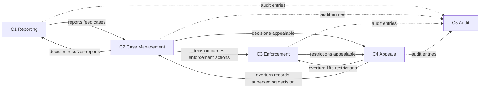
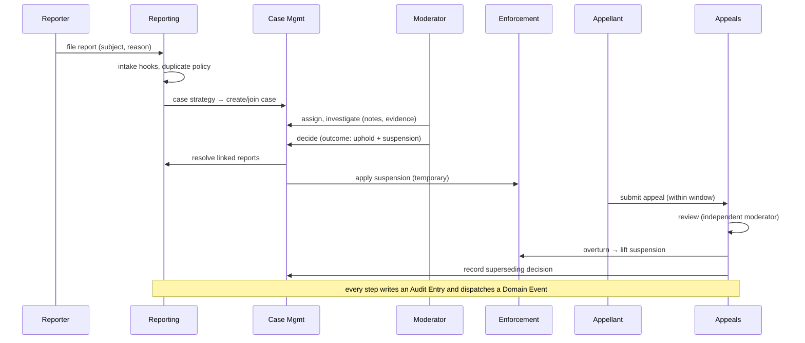

# Laravel Trust & Safety — Domain Map

**Phase:** 2 — Domain Discovery
**Produced by:** Domain Analysis team (T2)
**Approver:** Fable (Project Director)
**Status:** DRAFT — awaiting approval (Gate G2)
**Version:** 1.0.0
**Date:** 2026-07-14
**Upstream:** [Requirements](../requirements.md) (G1) · [Glossary](glossary.md)

This document maps the trust & safety domain into five bounded contexts, their owned
concepts, and the flows between them. It is a *conceptual* map: aggregate boundaries,
entities, and invariants are Phase 3; package structure is Phase 4. All terms are as
defined in the [glossary](glossary.md).

---

## 1. Bounded Contexts

### C1 — Reporting
Intake of claims about subjects.

- **Owns:** Report, Reason, Reason Category, Reportable capability, duplicate policy,
  reporter identity (model / System / Anonymous).
- **Responsibilities:** validate and persist reports (FR-100), manage the reason taxonomy
  (FR-150), expose report queries (FR-108), run intake automation hooks (FR-804).
- **Emits:** `ReportFiled` and report state-transition events.
- **Knows nothing about:** how cases are decided, what enforcement exists.

### C2 — Case Management
Organizing reports into decidable units of work.

- **Owns:** Case, Case Strategy, Assignment, Priority, Note, Evidence, case workflow.
- **Responsibilities:** create cases from reports per strategy (FR-205–206), lifecycle and
  assignment (FR-202–203), investigation records (FR-250), triage automation hooks
  (FR-804), and producing Decisions (FR-300) — the deciding *act* lives here; the
  *consequences* do not.
- **Emits:** case lifecycle events, `CaseDecided`.
- **Depends on:** C1 (consumes reports; resolves their states on decision, FR-305).

### C3 — Enforcement
Consequences applied to subjects.

- **Owns:** Restriction, Restriction Type, Suspension, Warning, Scope, Restrictable
  capability, lift/expiry/supersede semantics, the runtime check API (FR-405), the expiry
  command (FR-404).
- **Responsibilities:** apply enforcement actions carried by decisions (FR-303), maintain
  restriction lifecycles (FR-402–404), answer "is subject X restricted?" efficiently.
- **Emits:** `RestrictionApplied/Lifted/Expired`, `WarningIssued`, etc.
- **Depends on:** C2 only through the Decision reference on a restriction (FR-402);
  restrictions MAY also be applied directly (decision-less) by an authorized actor.

### C4 — Appeals
Due process over decisions and restrictions.

- **Owns:** Appeal, Appeal Window, appeal workflow, appeal limits, reviewer-independence
  rule (FR-505, FR-604).
- **Responsibilities:** accept/reject submissions per window and limits (FR-503, FR-506),
  run appeal review lifecycle (FR-502), execute overturn effects (FR-504).
- **Depends on:** C2 (appealed decisions; overturn records a superseding decision) and
  C3 (overturn lifts restrictions).

### C5 — Audit
Accountability across all contexts.

- **Owns:** Audit Entry, Audit Trail, retention/pruning policy (FR-705).
- **Responsibilities:** append-only capture of every domain action from every context
  (FR-701–703), queryable history (FR-704).
- **Depends on:** nothing; every other context writes to it. Nothing reads audit data to
  make domain decisions — it is strictly a sink.

### Cross-cutting (not a context)
- **Authorization** (FR-600): gates/policies/scopes guard operations *within* each context.
- **Domain Events & Hooks** (FR-800): every context emits events; hooks are registered
  per context but follow one shared contract style.
- **Extension & Configuration** (FR-900/950): each context exposes its extension points;
  one config file governs all.

## 2. Context Relationships

Solid arrows are domain dependencies; dotted arrows are write-only audit flows.

## 3. Canonical Flow (happy path)

## 4. Requirement → Context Mapping

| Requirement group | Context |
|---|---|
| FR-100 Reporting, FR-150 Reasons | C1 Reporting |
| FR-200 Cases, FR-250 Investigation, FR-300 Decisions | C2 Case Management |
| FR-400 Enforcement | C3 Enforcement |
| FR-500 Appeals | C4 Appeals |
| FR-700 Audit | C5 Audit |
| FR-600 Authorization | Cross-cutting |
| FR-800 Events & Hooks | Cross-cutting |
| FR-900 Extension, FR-950 Configuration | Cross-cutting |

Every functional requirement maps to exactly one context or the cross-cutting layer; no
requirement is unowned and no context exists without requirements (review criterion for G2).

## 5. Boundary Decisions (candidate ADR topics for Phase 3/4)

1. **Decisions live in Case Management, not Enforcement** — deciding is case work;
   consequences are enforcement. Keeps C3 usable stand-alone (direct restrictions).
2. **Appeals is its own context**, not part of Case Management — different lifecycle,
   different authorization rules (reviewer independence), targets both decisions and
   restrictions.
3. **Audit is a pure sink** — no domain behavior may read audit data; anything a workflow
   needs must live in its own context's state.
4. **Warnings live in Enforcement, not Decisions** — a warning is a consequence with its
   own queryable history (FR-406), even though usually issued via a decision.
5. **Anonymous and System reporters are Reporting-context concerns** — identity resolution
   never leaks into other contexts; they see only "the report".

## 6. Definition of Done — Phase 2

- [x] Bounded contexts defined with single responsibilities (C1–C5)
- [x] Context relationships and canonical flow diagrammed
- [x] Every requirement mapped to a context; every context justified by requirements
- [x] Glossary complete and consistent with this map
- [ ] Fable review passed
- [ ] Project owner approval — **Gate G2**

**Next phase upon approval:** Phase 3 — Domain Modeling (entities, value objects,
invariants, aggregate boundaries, first ADRs: polymorphic subject strategy, reporter
identity strategy).
