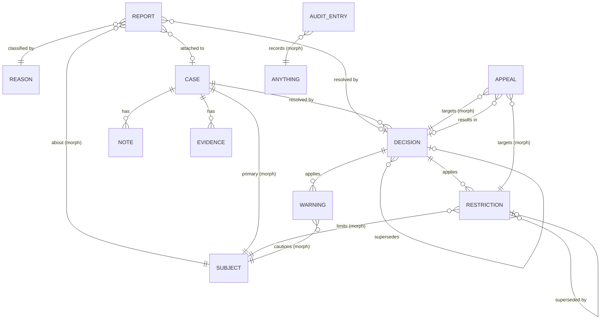

# Laravel Trust & Safety — Domain Model

**Phase:** 3 — Domain Modeling
**Produced by:** Domain Modeling team (T3)
**Approver:** Fable (Project Director)
**Status:** DRAFT — awaiting approval (Gate G3)
**Version:** 1.0.0
**Date:** 2026-07-14
**Upstream:** [Domain Map](domain-map.md) · [Glossary](glossary.md) (Gate G2 approved 2026-07-14)
**ADRs introduced:** [0001](../adr/0001-polymorphic-subject-strategy.md), [0002](../adr/0002-reporter-and-actor-identity.md), [0003](../adr/0003-immutability-enforcement.md)

This document defines the entities, value objects, relationships, invariants, and
lifecycle ownership of the domain. It is conceptual: attribute lists are *domain*
attributes (schema details, identifiers, and indexes are Phase 6; class design is
Phases 4–5). Aggregate boundaries here are **consistency guidance for Eloquent models**,
not a DDD framework — per the roadmap, we build idiomatic Laravel, not a framework inside
Laravel.

---

## 1. Entities

### E1 — Report (root, C1 Reporting)
A reporter's claim about a subject.

| Attribute | Notes |
|---|---|
| subject | polymorphic → any Reportable model (ADR-0001) |
| reporter + origin | nullable polymorphic + origin (`model`/`system`/`anonymous`) (ADR-0002) |
| reason | → Reason (E2) |
| comment | opaque text, optional (NFR-09) |
| metadata | structured, application-defined, optional (FR-107) |
| state | `pending → under_review → attached_to_case → resolved / dismissed` (FR-104) |
| case | nullable → Case (E3), set when attached |
| resolving decision | nullable → Decision (E6), set on resolution (FR-305) |

### E2 — Reason (root, C1 Reporting)
| Attribute | Notes |
|---|---|
| key | machine key, unique, stable (FR-153) |
| label | app-localizable display name |
| category | optional one-level grouping (FR-154) |
| active | deactivation never invalidates history (FR-155) |

### E3 — Case (root, C2 Case Management)
The unit of moderation work.

| Attribute | Notes |
|---|---|
| primary subject | polymorphic (FR-201, ADR-0001) |
| state | `open → under_investigation → awaiting_decision → decided → closed` (FR-202) |
| assignee | nullable polymorphic actor (FR-203) |
| priority | configurable set (FR-204) |
| reports | one-to-many ← Report |
| notes / evidence | children (E4, E5) |
| decisions | one-to-many ← Decision; latest effective decision derivable |

### E4 — Note (child of Case, C2)
Authored, timestamped, immutable (FR-251, FR-254, ADR-0003). Attributes: case, author
actor, body (opaque).

### E5 — Evidence (child of Case, C2)
Immutable record referencing a polymorphic model and/or structured payload (FR-252,
ADR-0003). No file storage.

### E6 — Decision (root identity, owned by Case lifecycle, C2)
Immutable resolution record (FR-301–305, ADR-0003).

| Attribute | Notes |
|---|---|
| case | → Case |
| decider | actor (never System for final case decisions unless via automation hook, then attributed as System per FR-805) |
| outcome | shipped: `dismiss`/`uphold`/`escalate`; app-extensible (FR-302) |
| rationale | opaque text, optional |
| supersedes | nullable → Decision (amendments/overturns are new decisions, FR-304) |
| enforcement actions | zero or more Restrictions/Warnings applied atomically (FR-303) |

### E7 — Restriction (root, C3 Enforcement)
| Attribute | Notes |
|---|---|
| subject | polymorphic → any Restrictable model (FR-401, ADR-0001) |
| type | app-extensible; `suspension` shipped (FR-402, FR-407) |
| scope | value object, optional (FR-402, FR-602) |
| issuer | actor (ADR-0002) |
| decision | nullable → Decision — restrictions may be direct (domain map §5.1) |
| expires_at | null ⇔ permanent (FR-403) |
| state | `active → expired / lifted / superseded` (FR-402) |
| lift record | lifting actor + reason when lifted (FR-408) |
| superseded_by | nullable → Restriction |

### E8 — Warning (root, C3 Enforcement)
Formal caution (FR-406): subject (polymorphic), issuer actor, reason text (opaque),
optional decision reference, optional expires_at. Queryable count/active history.

### E9 — Appeal (root, C4 Appeals)
| Attribute | Notes |
|---|---|
| appealed | polymorphic → Decision or Restriction (FR-501) |
| appellant | actor (ADR-0002) |
| statement | opaque text, optional |
| state | `submitted → under_review → upheld / overturned / rejected` (FR-502) |
| reviewer | nullable actor; independence rule (FR-505, FR-604) |
| resulting decision | nullable → Decision, set on overturn (FR-504) |

### E10 — Audit Entry (root, C5 Audit)
Append-only (FR-701–703, ADR-0003): actor (nullable + origin, ADR-0002), action key,
auditable (polymorphic), structured payload, timestamp. No update/delete API exists.

## 2. Value Objects

| VO | Definition |
|---|---|
| **State** | Named lifecycle position per state machine; core states non-removable (FR-903). |
| **ReporterOrigin / ActorOrigin** | `model` / `system` / `anonymous` (reports only) — ADR-0002. |
| **Outcome** | Decision classification; open set with shipped defaults (FR-302). |
| **RestrictionType** | Open set with shipped `suspension` (FR-402/407). |
| **Scope** | Opaque-to-package identifier resolved by app contract (FR-602). |
| **Priority** | Configurable ordered set (FR-204). |
| **AuditPayload** | Structured changes snapshot (FR-702). |

Open-set VOs (Outcome, RestrictionType, Scope, Priority) are string-backed with
package-shipped constants — extensible without enum modification (FR-902).

## 3. Entity-Relationship Diagram

(`SUBJECT` and `ANYTHING` are polymorphic targets, not tables; `APPEAL` targets exactly
one of Decision or Restriction via a single morph.)

## 4. Invariant Catalog

| ID | Invariant | Source |
|---|---|---|
| I-01 | A report always has a reason and a subject; reporter present ⇔ origin is `model`. | FR-102/103 |
| I-02 | No duplicate open report (same reporter, subject, reason) unless configured. | FR-105 |
| I-03 | All lifecycle state changes go through transitions — no direct state writes. | FR-104/202/402/502 |
| I-04 | Every transition records an actor (or System), emits an event, writes an audit entry. | FR-701/801/802 |
| I-05 | A case has exactly one primary subject, fixed at creation. | FR-201 |
| I-06 | A decision requires a case in a decidable state; deciding transitions the case and resolves its open reports. | FR-301/305 |
| I-07 | Decisions, notes, evidence, and audit entries are never updated or deleted via the package. | FR-254/304/703, ADR-0003 |
| I-08 | Enforcement actions attached to a decision persist atomically with it. | FR-303 |
| I-09 | `expires_at = null` ⇔ permanent restriction; a dated restriction evaluates inactive past expiry regardless of its stored state. | FR-403/404 |
| I-10 | Lifting requires an active restriction and records actor + reason. | FR-408 |
| I-11 | Appeal submission requires: within window, per-target count below limit, appellant authorized. | FR-501/503/506 |
| I-12 | Appeal reviewer ≠ original decider when independence is enabled. | FR-505/604 |
| I-13 | Overturn lifts associated restrictions and records a superseding decision — atomically. | FR-504 |
| I-14 | Reason/outcome/type deactivation or removal never mutates historical records. | FR-155 |
| I-15 | Every state-changing operation passes its gate/policy before executing. | FR-601 |

Invariants are enforced in domain operations (actions/services, Phase 4), not in
application code, and each gets a dedicated test (NFR-07 review criterion).

## 5. Aggregate Boundaries & Lifecycle Ownership

| Aggregate root | Contains | Lifecycle owner of | May reference (by id only) |
|---|---|---|---|
| Report | — | its own state | Reason, Case, Decision, subject |
| Reason | — | active flag | — |
| Case | Notes, Evidence | case state, assignment, priority | subject, assignee actor |
| Decision | its enforcement-action links | nothing after creation (immutable) | Case, prior Decision |
| Restriction | its lift record | restriction state, expiry | subject, Decision, successor |
| Warning | — | its expiry | subject, Decision |
| Appeal | — | appeal state, reviewer | Decision/Restriction, resulting Decision |
| Audit Entry | — | nothing (append-only) | anything (morph) |

Rules: cross-aggregate operations (decide → resolve reports + apply restrictions;
overturn → lift + supersede) are **domain operations** wrapped in a database transaction —
the only places multi-aggregate consistency is coordinated (I-06, I-08, I-13).

## 6. Definition of Done — Phase 3

- [x] Every glossary concept modeled as entity, VO, or explicitly attribute-only
- [x] All relationships diagrammed; polymorphism deliberate and ADR-backed
- [x] Invariant catalog complete and requirement-traced
- [x] Aggregate/lifecycle ownership defined; no speculative entities
- [x] ADRs 0001–0003 drafted
- [ ] Fable review passed
- [ ] Project owner approval — **Gate G3**

**Next phase upon approval:** Phase 4 — Architecture (package structure, layering,
action/service pattern, exception strategy, dependency policy).
