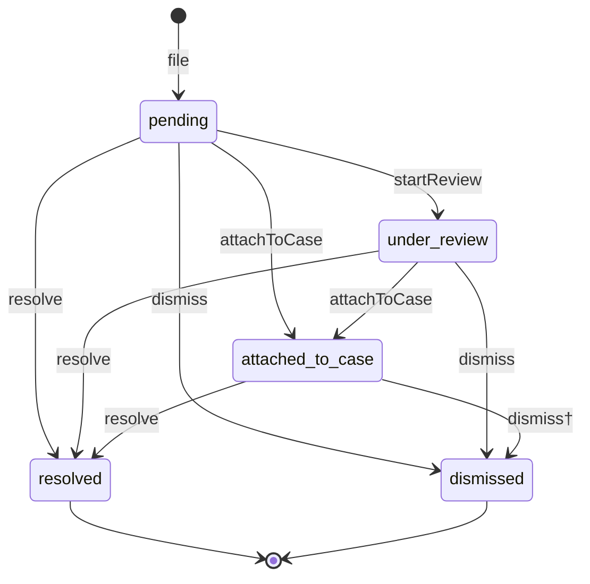
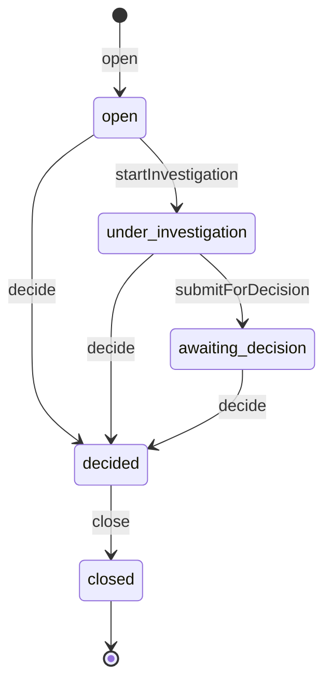
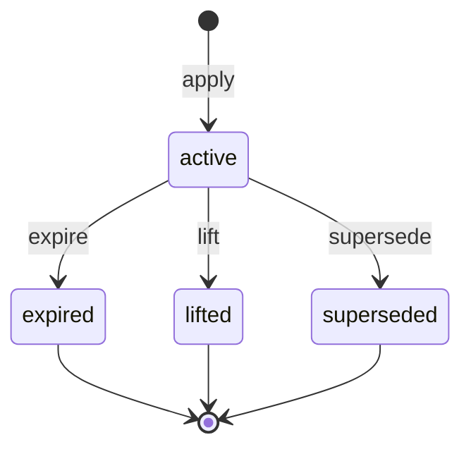
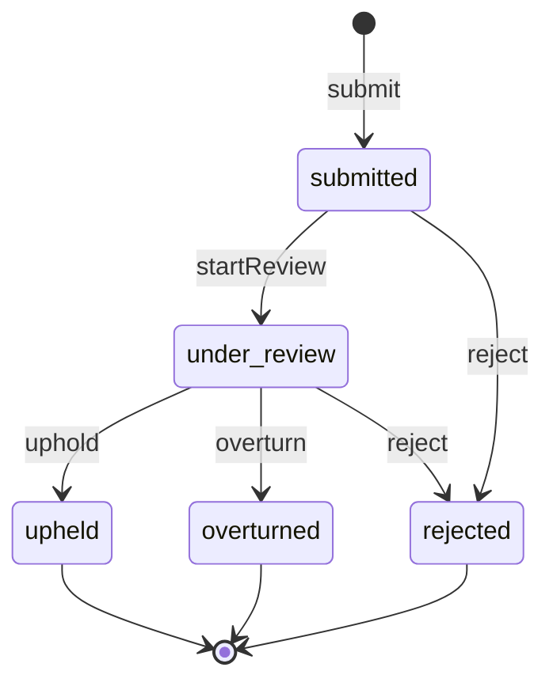

# Workflows

Four state machines govern the domain. States are stored as
strings, transitions are verbs, and state columns are write-protected:
only the workflow engine moves them — assigning `$report->state`
directly throws. (Stateful package models implement the `Stateful`
contract.)

Each lifecycle pairs a state enum with a container-bound definition:
`ReportState`/`ReportWorkflow`, `CaseState`/`CaseWorkflow`,
`RestrictionState`/`RestrictionWorkflow`,
`AppealState`/`AppealWorkflow`.

## Report

† attached reports resolve or dismiss only through their case's
decision.

## Case

Priority (escalation) is an attribute, not a state.

## Restriction

A stored `active` past its `expires_at` already counts as inactive
everywhere — the expiry transition is bookkeeping
([enforcement](enforcement.md)).

## Appeal

## Invalid transitions

Every transition attempt from a wrong state throws
`InvalidTransition`, carrying the record, transition name, and
from-state. Guards may veto an otherwise-legal transition by throwing.

## Custom transitions

Applications extend a lifecycle by subclassing its
`WorkflowDefinition` and rebinding it — add-only, boot-validated:
shipped states, transitions, and terminals can never be removed or
rewired, so package code keeps working (ADR-0019). A custom transition
connects two *existing* states (it cannot introduce a new one) and
gets the full pipeline: authorization, guards, an audit entry, and the
generic `StateTransitioned` event. The how-to lives in
[extending](extending.md#workflow-extension-x5).
