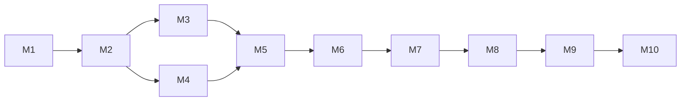

# Laravel Trust & Safety — Implementation Plan

**Phase:** 13 — Implementation Planning
**Produced by:** Fable with team leads (T5, T12, T14)
**Approver:** Fable (Project Director) → Project owner (**Gate G13 authorizes implementation**)
**Status:** DRAFT — awaiting approval
**Version:** 1.0.0
**Date:** 2026-07-14
**Upstream:** ALL design phases approved (Gates G0–G12); ADRs 0001–0017 binding

Ten milestones, strictly ordered by dependency. Cross-cutting infrastructure (audit,
events, workflow engine) lands **before** the domain modules that use it — a deliberate
refinement of the roadmap's sketch so no milestone ships half-wired operations.

## Universal Milestone DoD

Every milestone independently satisfies, before the next begins:

1. Implements its slice of the approved design exactly; deviations require a superseding
   ADR *first* (roadmap Phase 14 rule).
2. Its tests (per the Phase 11 maps) and its docs (per the Phase 12 tree) ship inside the
   milestone.
3. CI fully green: run-tests matrix, PHPStan level 9 (empty baseline), type ≥95%,
   line ≥90%, Pint, arch tests.
4. Fable review + approval recorded (milestone gate inside Phase 14).

## Milestones

### M1 — Foundation
**Deliverables:** corrected composer constraints (Laravel `^12||^13`, testing-strategy §1);
ADR-0004 directory/namespace scaffold; `CaseworkServiceProvider` (config, publishable
migration wiring, binding map stubs); complete `config/casework.php` (Phase 10 spec);
config boot-validation; model registry (X1); exception hierarchy (`CaseworkException` +
all Phase 5 §10 classes); Support VOs (`ActorRef`, `Origin`, open-set value handling);
`ScopeResolver` contract + `NullScopeResolver`; workbench fixture models (bigint + ULID);
CI additions (integration-tests.yml, coverage/type gates, arch-test step).
**Depends on:** —. **Team/model:** T14, mid-tier; CI files small-model.
**Accept:** provider boots on Testbench L12+L13; every config key validated with tests;
arch tests enforce ADR-0017/0004 from day one.

### M2 — Persistence
**Deliverables:** ten migrations (Phase 6 order, prefix-aware, string(36) morphs);
ten Eloquent models with relations, casts, query scopes (Phase 5 surface), immutability
enforcement (ADR-0003) on Decision/Note/Evidence/AuditEntry + guarded `state` columns;
factories for all models (lifecycle states via actions arrive with later milestones —
factories initially cover creation states only, extended per milestone).
**Depends on:** M1. **Team/model:** T14, mid-tier; factories small-model.
**Accept:** migrations up/down on all four DBs (integration workflow); scope unit tests;
`ImmutableRecord` thrown on every mutation path; morph fixtures pass for bigint + ULID.

### M3 — Workflow Engine
**Deliverables:** `States\` engine + four `WorkflowDefinition`s exactly matching Phase 7
tables; guard class infrastructure; ADR-0013 extension API with boot validation
(connectivity, terminals, collisions); `StateTransitioned` generic event; the
generated-from-definitions exhaustive test harness (96 pairs).
**Depends on:** M2. **Team/model:** T14 with strong-model design review (Fable) — this is
the correctness keystone. **Accept:** every Phase 7 table row exercised; every ADR-0013
violation case throws at boot; direct state writes impossible.

### M4 — Audit
**Deliverables:** Audit `Recorder` (final, non-rebindable — sole writer); `AuditEntry`
query surface (Phase 5 §7); `casework:prune-audit` command (opt-in, FR-705);
audit assertions helper for the test suite (asserting entries in all later milestones).
**Depends on:** M2. **Team/model:** T14, mid-tier.
**Accept:** append-only verified; pruning refuses without config; timeline queries indexed
(query-count tests).

### M5 — Reporting Module
**Deliverables:** `Reason` management; report pending-builder + `FileReport`,
`StartReportReview`, `AttachReportToCase` (stub until M6 wires cases — see note),
`DismissReport`, `ResolveReport` actions; duplicate guard (I-02); reporting events (5) +
audit keys; reporting policies incl. anonymous toggle; `InteractsWithReports` trait;
reporting.md guide.
**Note:** `AttachReportToCase` lands here mechanically but its strategy-driven callers
arrive in M6.
**Depends on:** M3, M4. **Team/model:** T14, mid-tier.
**Accept:** I-01/I-02 tests; FR-100/150 traceability grep passes; quickstart §report
example runs verbatim.

### M6 — Cases & Investigation Module
**Deliverables:** case pending-builder + `OpenCase`, `AssignCase`, `StartInvestigation`,
`SubmitForDecision`, `EscalateCase`, `CloseCase`, `AddNote`, `AttachEvidence` actions;
`CaseStrategy` contract + `always`/`threshold`/`manual` implementations wired into
`FileReport`; case events (8 of 9 — `CaseDecided` in M7) + audit keys; case policies
(scope-aware); cases-and-decisions.md (case half).
**Depends on:** M5. **Team/model:** T14, mid-tier.
**Accept:** I-05 tests; strategy matrix tests (each strategy × thresholds); assignment/
priority scope queries index-verified.

### M7 — Decisions & Enforcement Module
**Deliverables:** decision builder + `DecideCase` (atomic: case transition + report
resolution + enforcement application, I-06/I-08); restriction/suspension/warning
builders + `ApplyRestriction`, `LiftRestriction`, `ExpireRestrictions` (+ command),
`SupersedeRestriction`, `IssueWarning`; hot-path `isRestricted` (single-query, NFR-04);
`InteractsWithRestrictions` trait; enforcement + `CaseDecided` events; self-moderation
policy guard (FR-604); enforcement.md + decisions half of cases-and-decisions.md.
**Depends on:** M6. **Team/model:** T14; atomicity paths get strong-model review.
**Accept:** induced-failure rollback tests (I-08); real-time expiry tests (I-09);
query-count = 1 on hot path; occurrence-ordered events (ADR-0015) verified.

### M8 — Appeals Module
**Deliverables:** appeal builder + `SubmitAppeal`, `AssignAppeal`, `StartAppealReview`,
`ResolveAppeal` (uphold/overturn/reject); window/limit/independence guards
(I-11/I-12); atomic overturn (lift + superseding decision, I-13); appeal events (6);
appeals.md.
**Depends on:** M7. **Team/model:** T14; overturn atomicity strong-model review.
**Accept:** window/limit boundary tests (edges: exact expiry instant, limit N vs N+1);
independence toggle matrix; overturn rollback test.

### M9 — Hooks & Extension Surface
**Deliverables:** `Notifier` dispatch loop (after-commit, ordered); intake + triage
pipelines (`ReportIntake` context, System attribution, short-circuit semantics);
verification suite for X1–X13 (model override end-to-end incl. relations; action rebind;
guard rebind; workflow extension happy path — violations already tested in M3);
events.md, automation.md, extending.md guides.
**Depends on:** M5–M8 (hooks touch every module). **Team/model:** T14, mid-tier.
**Accept:** full Phase 9 §3 guarantee tests; T10 doc obligations 1–4, 7–8 landed.

### M10 — Polish, Docs & Release-Readiness
**Deliverables:** remaining guide pages (installation, quickstart, audit, authorization,
workflows, configuration, exceptions, testing-your-integration); README rewrite from the
Phase 12 skeleton + Spatie-leftover cleanup (placeholder text, ad block, FUNDING.yml);
UPGRADE.md stub; docblock pass; doc-completeness CI script (M4 map) + FR-traceability
script; CHANGELOG entry.
**Depends on:** M9. **Team/model:** docs mid-tier, docblocks/cleanup small-model.
**Accept:** M1/M2 walkthrough executed verbatim on a fresh workbench app; doc CI scripts
green; every Phase 12 §4 obligation present.

## Dependency Graph

M3 and M4 may proceed in parallel after M2; everything else is serial.

## Phase 14 Working Agreement

- One PR per milestone against `main`, reviewed at the milestone gate; no cross-milestone
  PRs. Each PR includes its tests and docs (universal DoD #2).
- Any discovered design gap stops the milestone → ADR amendment → resume. The gap list
  feeds Phase 15's review.
- After M10: Phase 15 (whole-package internal review), Phase 16 (stabilization/API
  freeze), Phase 17 (release prep) per the roadmap.

## Definition of Done — Phase 13

- [x] Milestones independently reviewable, dependency-ordered, each with acceptance criteria including tests and docs
- [x] Cross-cutting infrastructure sequenced before its consumers
- [x] Team/model assignments per the roadmap's model strategy
- [x] Working agreement for Phase 14 fixed
- [ ] Fable review passed
- [ ] Project owner approval — **Gate G13: implementation authorized**
