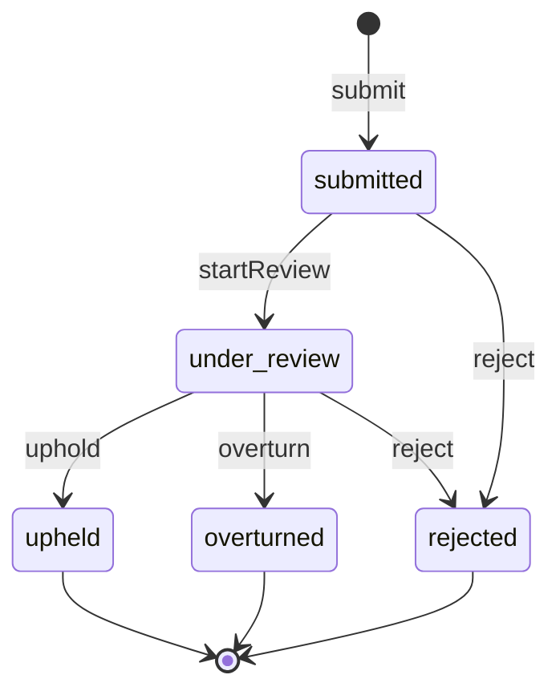

# Appeal Lifecycle

Part of [Phase 7 — Workflows](overview.md). Source: FR-501–506, I-11/I-12/I-13.

## Transition Table

| Transition | From → To | Actor | Guards | Event | Audit key |
|---|---|---|---|---|---|
| `submit` | (new) → submitted | Appellant | within appeal window (FR-506); per-target limit (FR-503); target is appealable Decision/Restriction; policy | `AppealSubmitted` | `appeal.submitted` |
| `startReview` | submitted → under_review | Reviewer | reviewer independence — reviewer ≠ original decider/issuer when enabled (I-12, FR-505/604); policy | `AppealReviewStarted` | `appeal.review_started` |
| `uphold` | under_review → upheld | Reviewer | policy | `AppealUpheld` | `appeal.upheld` |
| `overturn` | under_review → overturned | Reviewer | atomic effects (I-13): lift associated active restrictions + record superseding decision (FR-504); policy | `AppealOverturned` | `appeal.overturned` |
| `reject` | submitted, under_review → rejected | Reviewer or System | rejection reason recorded in audit payload | `AppealRejected` | `appeal.rejected` |

## Non-transition operations

| Operation | Event | Audit key |
|---|---|---|
| `assignAppeal` (FR-505) | `AppealAssigned` | `appeal.assigned` |

Notes: `reject` from `submitted` covers administrative rejection (limit/window edge cases
surfaced post-submission); guard-level rejections at `submit` never create a record —
they throw (`AppealWindowClosed`, `AppealLimitReached`). Overturn effects reuse the
Restriction machine's `lift` and the Decision supersede mechanism — no special-case
writes. Terminal: `upheld`, `overturned`, `rejected`.
