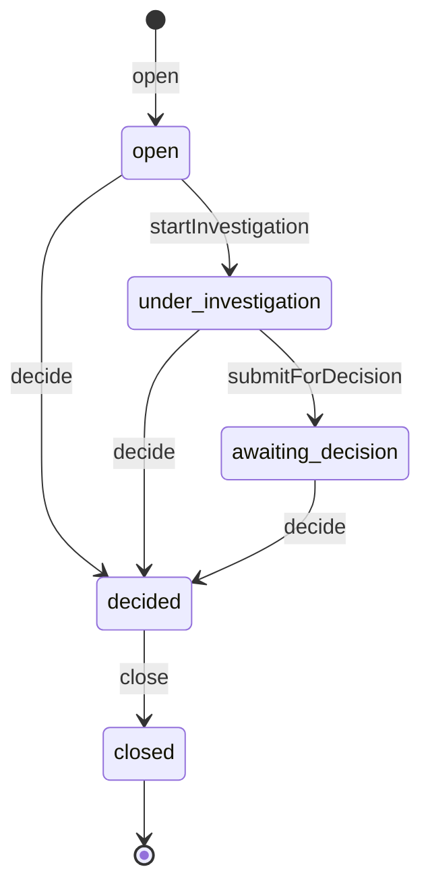

# Case Lifecycle

Part of [Phase 7 — Workflows](overview.md). Source: FR-202–208, FR-301–305, I-05/I-06/I-08.

## Transition Table

| Transition | From → To | Actor | Guards | Event | Audit key |
|---|---|---|---|---|---|
| `open` | (new) → open | Moderator or System (case strategy FR-205) | subject fixed at creation (I-05); policy | `CaseOpened` | `case.opened` |
| `startInvestigation` | open → under_investigation | Moderator | policy (scope) | `CaseInvestigationStarted` | `case.investigation_started` |
| `submitForDecision` | under_investigation → awaiting_decision | Moderator | policy | `CaseAwaitingDecision` | `case.awaiting_decision` |
| `decide` | open, under_investigation, awaiting_decision → decided | Moderator (or System via triage hook, FR-805) | outcome valid (FR-302); self-moderation guard (FR-604); policy (scope); atomic effects: resolve reports + apply enforcement (I-06, I-08) | `CaseDecided` | `case.decided` |
| `close` | decided → closed | Moderator or System | policy | `CaseClosed` | `case.closed` |

## Non-transition operations (state unchanged, still evented + audited)

| Operation | Event | Audit key |
|---|---|---|
| `assignCase` / reassign (FR-203) | `CaseAssigned` | `case.assigned` |
| `escalateCase` (priority change) | `CaseEscalated` | `case.escalated` |
| `note` (FR-251) | `CaseNoteAdded` | `case.note_added` |
| `attachEvidence` (FR-252) | `CaseEvidenceAttached` | `case.evidence_attached` |

Notes: `decide` is legal from all three pre-decided states — lightweight flows may skip
investigation. A superseding decision (FR-304) on a decided/closed case does **not**
reopen it; it records a new Decision and its own effects. Terminal: `closed`.
