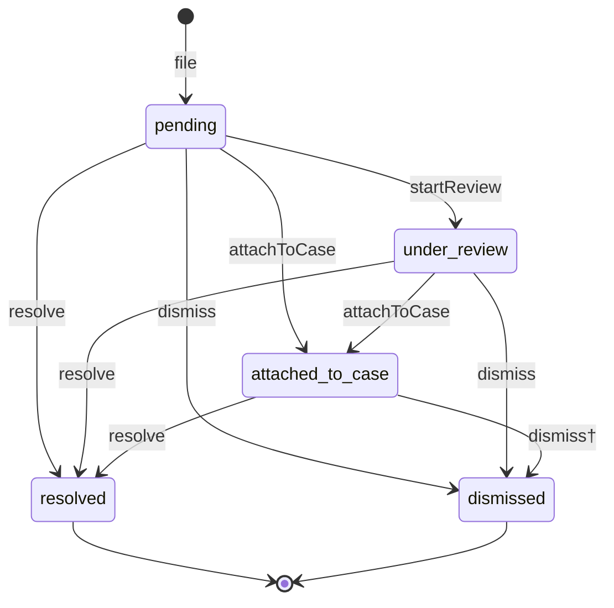

# Report Lifecycle

Part of [Phase 7 — Workflows](overview.md). Source: FR-104, FR-305, I-01/I-02.

† only as part of a case decision with outcome `dismiss` — never directly while attached.

## Transition Table

| Transition | From → To | Actor | Guards | Event | Audit key |
|---|---|---|---|---|---|
| `file` | (new) → pending | Reporter (model/system/anonymous) | reason exists & active; duplicate policy (I-02); origin/reporter consistency (I-01); policy | `ReportFiled` | `report.filed` |
| `startReview` | pending → under_review | Moderator | policy (scope) | `ReportReviewStarted` | `report.review_started` |
| `attachToCase` | pending, under_review → attached_to_case | Moderator or System (case strategy, FR-205/206) | target case is open-phase; same-subject rule; policy | `ReportAttachedToCase` | `report.attached_to_case` |
| `dismiss` | pending, under_review → dismissed | Moderator | policy; not attached (attached reports dismiss only via decision) | `ReportDismissed` | `report.dismissed` |
| `resolve` | pending, under_review, attached_to_case → resolved | System (inside `DecideCase`, FR-305) or Moderator (unattached) | decision reference set when via case (I-06) | `ReportResolved` | `report.resolved` |

Notes: `attachToCase` on an under_review report keeps review provenance in audit;
duplicate policy applies only at `file`. Terminal: `resolved`, `dismissed`.
