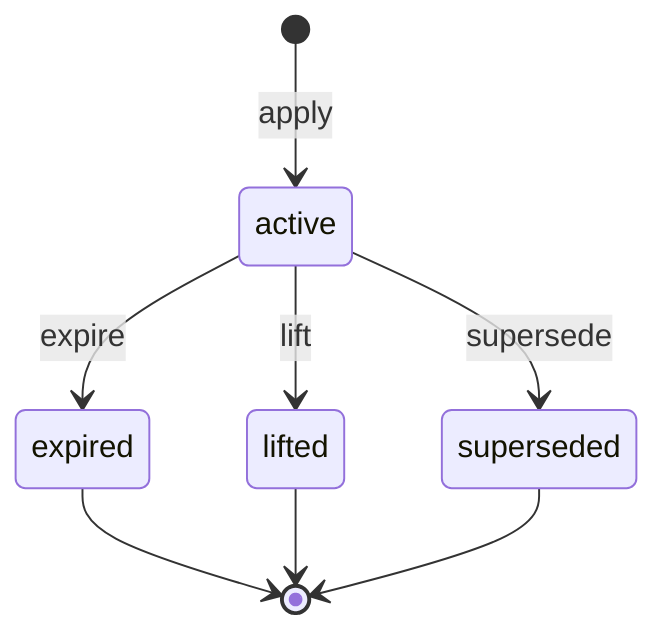

# Restriction Lifecycle

Part of [Phase 7 — Workflows](overview.md). Source: FR-401–409, I-09/I-10.

## Transition Table

| Transition | From → To | Actor | Guards | Event | Audit key |
|---|---|---|---|---|---|
| `apply` | (new) → active | Moderator (direct) or System (via `DecideCase`/hooks) | subject Restrictable; type known; `expires_at` future or null (I-09); policy (scope) | `RestrictionApplied` | `restriction.applied` |
| `expire` | active → expired | System (`casework:expire-restrictions`, FR-404) | `expires_at` ≤ now | `RestrictionExpired` | `restriction.expired` |
| `lift` | active → lifted | Moderator (or System on appeal overturn, I-13) | restriction currently active (I-10); reason required (FR-408); policy | `RestrictionLifted` | `restriction.lifted` |
| `supersede` | active → superseded | System (while applying the replacing restriction) | replacement targets same subject+type; atomic with replacement's `apply` | `RestrictionSuperseded` | `restriction.superseded` |

## The real-time rule (I-09, FR-404)

A stored state of `active` with `expires_at` in the past **evaluates as inactive
everywhere** (`isRestricted()`, `activeRestrictions()`, facade checks) — the `expire`
transition is bookkeeping that formalizes the event + audit trail, not the source of
truth. Consequence: the scheduled command's cadence affects only event/audit latency,
never enforcement correctness.

Warnings (FR-406) are **not** state machines: they have `expires_at` and activity is
purely time-derived; issuing dispatches `WarningIssued` (`warning.issued`). Deliberate
simplicity — a two-state machine would duplicate the timestamp.

Terminal: `expired`, `lifted`, `superseded`.
